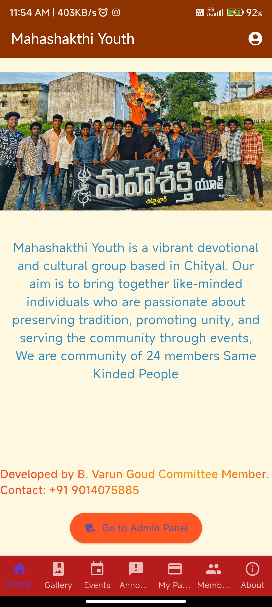
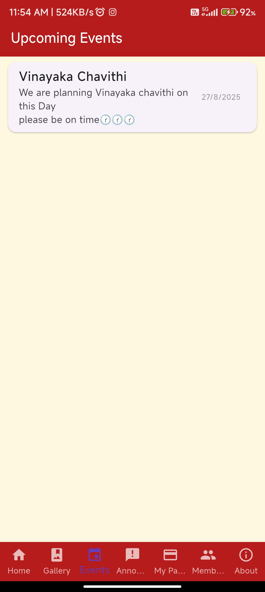

Perfect! Here’s your **fully updated professional README** with a proper **Screenshots section** that will display images correctly in GitHub:

````markdown
# MahashakthiYouthApp

MahashakthiYouthApp is a community-driven Flutter mobile application designed to connect youth members, volunteers, and committee members. This app centralizes event schedules, announcements, gallery uploads, donations, registrations, and more for the Mahashakthi Youth community.

---

## Table of Contents

- [Features](#features)
- [Screenshots](#screenshots)
- [Getting Started](#getting-started)
- [Prerequisites](#prerequisites)
- [Installation](#installation)
- [Firebase Setup](#firebase-setup)
- [Usage](#usage)
- [Technical Architecture & Folder Structure](#technical-architecture--folder-structure)
- [Dependencies](#dependencies)
- [Contributing](#contributing)
- [License](#license)
- [Contact](#contact)

---

## Features

- **Event Schedule:** View upcoming events and activities.
- **Gallery:** Upload and view photos and videos.
- **Announcements:** Stay updated with important news.
- **Donations:** Track contributions and manage payments.
- **Registrations & Competitions:** Sign up for events.
- **Committee & Volunteer Management:** Manage member roles and approvals.
- **Location & Maps:** Navigate event venues.
- **Community Chat:** Interact with members in real-time.
- **Profile Management:** Users can manage their profiles and roles.
- **OTP Verification:** Secure login for members and guests.

---

## Screenshots

The screenshots of the app are stored in `assets/screenshots/`. They are displayed below:

| Home Screen | Event Schedule | Gallery | Profile |
|-------------|----------------|---------|--------|
|  |  |  |  |

> **Note:** Make sure these image files are committed to Git and the file paths are correct.

---

## Getting Started

This project is a starting point for building a Flutter mobile application.

---

## Prerequisites

Make sure you have the following installed:

- [Flutter SDK](https://docs.flutter.dev/get-started/install)
- [Dart SDK](https://dart.dev/get-dart)
- [Android Studio](https://developer.android.com/studio) or [VS Code](https://code.visualstudio.com/)
- Firebase account for backend services (Firestore, Auth, Storage)

---

## Installation

1. Clone the repository:
   ```bash
   git clone https://github.com/yourusername/mahashakthiyouthapp.git
````

2. Navigate to the project directory:

   ```bash
   cd mahashakthiyouthapp
   ```
3. Install dependencies:

   ```bash
   flutter pub get
   ```
4. Run the app:

   ```bash
   flutter run
   ```

---

## Firebase Setup

1. Go to [Firebase Console](https://console.firebase.google.com/) and create a new project.
2. Add an Android/iOS app in the Firebase project.
3. Download `google-services.json` (for Android) and/or `GoogleService-Info.plist` (for iOS) and place them in the respective directories:

   * Android: `android/app/`
   * iOS: `ios/Runner/`
4. Enable Firebase services:

   * **Firestore Database:** For storing events, gallery data, and user profiles.
   * **Firebase Auth:** For OTP verification login.
   * **Firebase Storage:** For storing images and videos.
5. Initialize Firebase in `main.dart`:

   ```dart
   void main() async {
     WidgetsFlutterBinding.ensureInitialized();
     await Firebase.initializeApp();
     runApp(MyApp());
   }
   ```

---

## Usage

* Users can register as **Committee Members** or **Guests (Visitors)**.
* Committee Members require admin approval before accessing full features.
* Guests can login directly using OTP verification.
* Navigate through the bottom navigation bar to access events, gallery, announcements, and profile.

---

## Technical Architecture & Folder Structure

```
mahashakthiyouthapp/
│
├─ android/               # Android-specific files
├─ ios/                   # iOS-specific files
├─ lib/
│   ├─ main.dart          # Entry point
│   ├─ screens/           # All screens (Home, Events, Gallery, Profile, etc.)
│   ├─ widgets/           # Reusable widgets
│   ├─ services/          # Firebase services (Auth, Firestore, Storage)
│   └─ models/            # Data models (User, Event, GalleryItem)
├─ assets/
│   ├─ images/            # Image assets
│   └─ screenshots/       # App screenshots
├─ pubspec.yaml           # Project dependencies
└─ README.md
```

---

## Dependencies

```yaml
name: mahashakthiyouthapp
description: "A new Flutter project."
publish_to: 'none'
version: 1.0.0+1

environment:
  sdk: ^3.8.1

dependencies:
  flutter:
    sdk: flutter
  firebase_core: ^2.30.0
  firebase_auth: ^4.17.0
  cloud_firestore: ^4.15.0
  cupertino_icons: ^1.0.8
  animated_text_kit: ^4.2.2
  url_launcher: ^6.2.6
  video_player: ^2.8.2
  chewie: ^1.7.4
  photo_view: ^0.14.0
  youtube_player_flutter: 9.0.4
  intl: ^0.18.1 
  image_picker: ^1.0.4
  firebase_storage: ^11.6.0
  http: ^0.13.6
  qr_flutter: ^4.0.0
  shared_preferences: ^2.2.2
  crypto: ^3.0.3
  flutter_launcher_icons: ^0.13.1
  flutter_inappwebview: ^6.0.0-beta.22
  firebase_messaging: ^14.7.10
  onesignal_flutter: ^5.1.0
  android_intent_plus: ^4.0.1
  flutter_image_compress: ^2.1.0

dev_dependencies:
  flutter_test:
    sdk: flutter
  flutter_lints: ^5.0.0

flutter_launcher_icons:
  android: true
  ios: true
  image_path: "assets/logo.jpeg"

flutter_launcher_name: ^0.0.1

flutter:
  uses-material-design: true
  assets:
    - assets/
```

---

## Contributing

Contributions are welcome! To contribute:

1. Fork the repository
2. Create a new branch (`git checkout -b feature/YourFeature`)
3. Make your changes
4. Commit your changes (`git commit -m 'Add some feature'`)
5. Push to the branch (`git push origin feature/YourFeature`)
6. Open a Pull Request

---

## License

This project is open-source under the [MIT License](LICENSE).

---

## Contact Developer

**B. Varun Goud**

* Email: [bandivarungoud05@gmail.com](mailto:bandivarungoud05@gmail.com)
* GitHub: [https://github.com/VarunGoud04](https://github.com/VarunGoud04)

